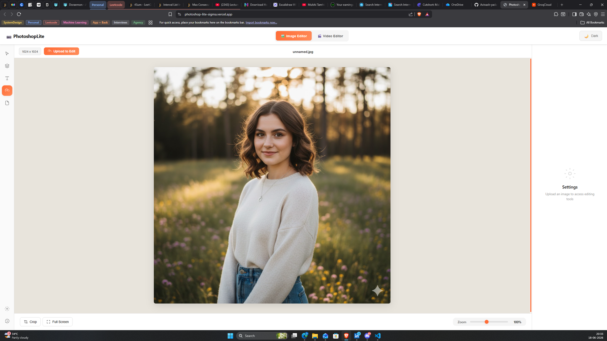
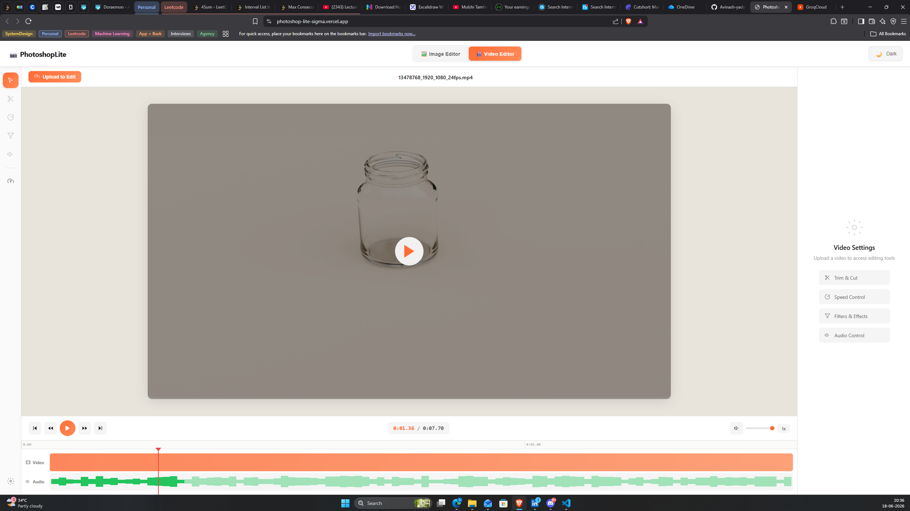
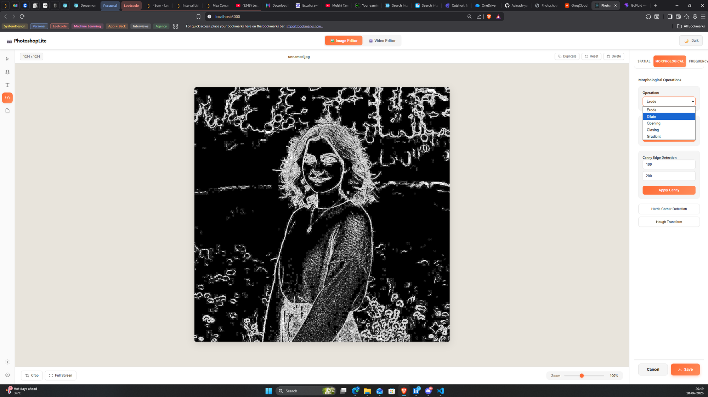

# Professional Image & Video Editing Software (Python + OpenCV + Flask)

## 📌 Project Overview
This project is a **Professional Image and Video Editing Platform** built entirely in **Python**, leveraging **OpenCV** for image/video processing and **Flask** for providing a web-based interface. The platform aims to provide advanced editing features similar to industry-level applications, supporting filters, transformations, and export optionss.

---

## 🎨 Platform Visuals

### Image Editor Interface

*Advanced image editing with real-time preview and comprehensive filter controls*

### Video Editor Interface

*Frame-by-frame video editing with timeline scrubbing and audio controls*

### Advanced Filters & Effects

*Morphological operations including edge detection, erosion, dilation, and more*

---

## 🎯 Core Functionalities

### 🔹 Image Editing Features
- Upload and preview images
- Crop, rotate, flip (horizontal/vertical)
- Resize (maintain aspect ratio or custom dimensions)
- Adjust brightness, contrast, saturation
- Apply filters:
  - Grayscale
  - Sepia
  - Invert
  - Blur, Gaussian Blur, Median Blur
  - Sharpen
  - Edge Detection (Canny, Sobel)
  - Cartoonify effect
  - Pencil Sketch effect
- Draw/annotate (lines, rectangles, circles, free draw)
- Text overlay (custom font, color, size)
- Add stickers, watermarks, logos
- Undo/Redo functionality

### 🔹 Video Editing Features
- Upload and preview videos
- Trim & merge video clips
- Extract audio, replace audio
- Frame-by-frame navigation
- Apply filters (grayscale, sepia, blur, edge detection, etc.)
- Add text overlays, captions
- Video stabilization (basic)
- Add transitions (fade in/out, cross dissolve)
- Convert video formats (mp4, avi, mkv, gif)
- Snapshot from video frames

### 🔹 Advanced Features
- Layer-based editing (like Photoshop/GIMP)
- Histogram equalization for color correction
- Face detection & automatic blur (privacy mode)
- Green screen (chroma key) effect
- AI-powered features (optional future scope):
  - Background removal
  - Style transfer filters
  - Object detection & segmentation

---

## 📂 Project Folder Structure

```
PhotoshopLite/
├── backend/
│   ├── app/
│   │   ├── __init__.py                # Flask app factory & blueprint registration
│   │   ├── config.py                  # Development/production configurations
│   │   ├── models/                    # Database models (SQLAlchemy ORM)
│   │   │   ├── __init__.py
│   │   │   ├── user.py                # User authentication model
│   │   │   ├── project.py             # Project/session management
│   │   │   └── asset.py               # Image/video metadata storage
│   │   ├── api/                       # RESTful API endpoints (Flask Blueprints)
│   │   │   ├── __init__.py
│   │   │   ├── auth.py                # User authentication endpoints
│   │   │   ├── assets.py              # File upload/download/management
│   │   │   ├── edits.py               # Image processing & filter operations
│   │   │   └── video.py               # Video processing endpoints
│   │   ├── services/                  # Core image/video processing engines
│   │   │   ├── __init__.py
│   │   │   ├── image_service.py       # OpenCV & Pillow processing functions
│   │   │   ├── video_service.py       # MoviePy & FFmpeg operations
│   │   │   ├── filters/               # Modular filter implementations
│   │   │   │   ├── __init__.py
│   │   │   │   ├── spatial_domain/    # Module I implementations
│   │   │   │   │   ├── brightness.py         # Gray-level transforms
│   │   │   │   │   ├── contrast.py           # Histogram processing
│   │   │   │   │   ├── gaussian_blur.py      # Smoothing filters
│   │   │   │   │   ├── edge_detection.py     # Prewitt, Sobel, Laplace
│   │   │   │   │   └── histogram_eq.py       # Histogram equalization
│   │   │   │   ├── morphological/     # Module II implementations
│   │   │   │   │   ├── canny_edge.py         # Canny edge detector
│   │   │   │   │   ├── harris_corner.py      # Harris corner detector
│   │   │   │   │   ├── morphology.py         # Dilation, erosion, opening, closing
│   │   │   │   │   ├── color_models.py       # RGB, HSV, YCbCr conversions
│   │   │   │   │   └── hough_transform.py    # Line & circle detection
│   │   │   │   ├── frequency_domain/  # Module III implementations
│   │   │   │   │   ├── fourier_transform.py  # FFT operations
│   │   │   │   │   ├── frequency_filters.py  # Low/high-pass filtering
│   │   │   │   │   ├── optical_flow.py       # Lucas-Kanade method
│   │   │   │   │   └── compression.py        # DCT, quantization
│   │   │   │   └── ml_features/       # Module IV implementations
│   │   │   │       ├── face_detection.py     # Viola-Jones method
│   │   │   │       ├── pca_analysis.py       # Principal Component Analysis
│   │   │   │       ├── sift_hog.py           # SIFT & HOG feature detection
│   │   │   │       └── video_analysis.py     # Motion estimation, MPEG
│   │   ├── tasks/                     # Background processing (Celery)
│   │   │   ├── __init__.py
│   │   │   ├── video_render.py        # Long-running video operations
│   │   │   └── batch_processing.py    # Bulk image operations
│   │   ├── utils/                     # Helper utilities & validators
│   │   │   ├── __init__.py
│   │   │   ├── storage.py             # Local & cloud storage handlers
│   │   │   ├── validators.py          # Input validation functions
│   │   │   ├── image_formats.py       # Format conversion utilities
│   │   │   └── math_operations.py     # Mathematical helper functions
│   │   ├── static/                    # Static files (CSS, JS, images)
│   │   │   ├── css/
│   │   │   ├── js/
│   │   │   └── images/
│   │   ├── templates/                 # HTML templates (if using server-side rendering)
│   │   └── uploads/                   # Temporary file storage
│   ├── requirements.txt               # Python dependencies
│   ├── Dockerfile                     # Backend containerization
│   ├── wsgi.py                        # WSGI application entry point
│   └── run.py                         # Development server launcher
│
├── frontend/ (Optional - for React/Vue frontend)
│   ├── src/
│   │   ├── components/
│   │   │   ├── ImageEditor/           # Main image editing interface
│   │   │   ├── VideoEditor/           # Video editing components
│   │   │   ├── FilterPanels/          # Individual filter controls
│   │   │   └── HistoryPanel/          # Undo/redo management
│   │   ├── api/                       # Backend API integration
│   │   ├── store/                     # State management (Redux/Vuex)
│   │   └── utils/
│   ├── package.json
│   └── public/
│
├── docs/
│   ├── syllabus.md                    # CSET344 course syllabus mapping
│   ├── architecture.md               # Technical architecture documentation
│   ├── api_documentation.md          # REST API specification
│   └── user_manual.md                # End-user documentation
│
├── tests/
│   ├── unit/                         # Unit tests for individual functions
│   ├── integration/                  # API endpoint testing
│   └── performance/                  # Image processing performance tests
│
├── samples/                          # Sample images & videos for testing
│   ├── images/
│   └── videos/
│
├── requirements.txt                  # Main project dependencies
├── docker-compose.yml               # Multi-container orchestration
├── .env.example                     # Environment variables template
├── .gitignore                       # Git ignore patterns
├── project.txt                      # Project specification document
├── syllabus.md                      # Course syllabus (CSET344)
└── README.md                        # This file
```

---

## 🎓 CSET344 Course Syllabus Integration

This project serves as a comprehensive implementation of the **CSET344: Image and Video Processing** course curriculum, demonstrating practical applications of theoretical concepts through a functional web-based editing platform.

### Module I: Spatial Domain Processing (8 Hours)
**Course Topics → Project Implementation**

| Course Topic | Implementation in Project |
|--------------|--------------------------|
| **Sampling & Quantization** | `image_service.py` - Image resizing, quality adjustment |
| **Histogram Processing** | `filters/spatial_domain/histogram_eq.py` - Real-time histogram equalization |
| **Gray-level Transforms** | `filters/spatial_domain/brightness.py`, `contrast.py` |
| **Spatial Filters** | `filters/spatial_domain/gaussian_blur.py` - Mean, median, Gaussian filters |
| **Edge Detection** | `filters/spatial_domain/edge_detection.py` - Prewitt, Sobel, Laplace filters |

**Practical Features:**
* Live histogram display and equalization
* Adjustable brightness/contrast sliders
* Multiple edge detection algorithms with parameter tuning
* Before/after comparison views

### Module II: Advanced Image Analysis (7 Hours)
**Course Topics → Project Implementation**

| Course Topic | Implementation in Project |
|--------------|--------------------------|
| **Canny Edge Detection** | `filters/morphological/canny_edge.py` - Interactive threshold adjustment |
| **Harris Corner Detection** | `filters/morphological/harris_corner.py` - Feature point visualization |
| **Color Models** | `filters/morphological/color_models.py` - RGB ↔ HSV ↔ YCbCr conversion |
| **Hough Transform** | `filters/morphological/hough_transform.py` - Line/circle detection |
| **Morphological Operations** | `filters/morphological/morphology.py` - Erosion, dilation, opening, closing |

**Practical Features:**
* Real-time color space conversion with live preview
* Interactive Hough transform for geometric shape detection
* Morphological operation chaining with custom kernels
* Corner detection with adjustable sensitivity

### Module III: Frequency Domain & Compression (8 Hours)
**Course Topics → Project Implementation**

| Course Topic | Implementation in Project |
|--------------|--------------------------|
| **Fourier Transform** | `filters/frequency_domain/fourier_transform.py` - FFT visualization |
| **Frequency Filtering** | `filters/frequency_domain/frequency_filters.py` - Ideal, Butterworth, Gaussian |
| **Optical Flow** | `filters/frequency_domain/optical_flow.py` - Lucas-Kanade motion tracking |
| **Image Compression** | `filters/frequency_domain/compression.py` - DCT, quantization, Huffman coding |

**Practical Features:**
* FFT magnitude/phase spectrum visualization
* Interactive frequency domain filtering
* Motion vector visualization in videos
* Lossy/lossless compression with quality metrics

### Module IV: Machine Learning & Video Processing (7 Hours)
**Course Topics → Project Implementation**

| Course Topic | Implementation in Project |
|--------------|--------------------------|
| **Face Detection** | `filters/ml_features/face_detection.py` - Viola-Jones cascade |
| **PCA Analysis** | `filters/ml_features/pca_analysis.py` - Eigenface implementation |
| **SIFT & HOG Features** | `filters/ml_features/sift_hog.py` - Feature extraction & matching |
| **Video Processing** | `services/video_service.py` - Motion estimation, MPEG compression |

**Practical Features:**
* Real-time face detection with bounding boxes
* PCA-based face recognition system
* SIFT keypoint matching between images
* Video compression with configurable parameters

---

## 🛠️ Technical Implementation Details

### Core Processing Engine
```python
# Example: Edge Detection Implementation (Module I)
def apply_sobel_edge_detection(image, threshold=50):
    """
    Implements Sobel edge detection as per CSET344 Module I curriculum
    """
    gray = cv2.cvtColor(image, cv2.COLOR_BGR2GRAY)
    
    # Sobel operators (as taught in course)
    sobel_x = cv2.Sobel(gray, cv2.CV_64F, 1, 0, ksize=3)
    sobel_y = cv2.Sobel(gray, cv2.CV_64F, 0, 1, ksize=3)
    
    # Magnitude calculation
    magnitude = np.sqrt(sobel_x**2 + sobel_y**2)
    
    # Apply threshold
    edges = np.uint8(magnitude > threshold) * 255
    
    return edges
```

### Laboratory Experiments Integration
The project includes all lab experiments mentioned in the syllabus:

* **Image Enhancement** - Brightness, contrast, gamma correction
* **Image Zooming** - Bilinear and bicubic interpolation
* **Image Cropping** - Region of interest selection
* **Image Restoration** - Noise reduction filters
* **Image Compression** - JPEG implementation with DCT
* **Image Segmentation** - Threshold-based and region growing

---

## ⚙️ Tech Stack

* **Backend Framework:** Python Flask (RESTful API architecture)
* **Image Processing:** OpenCV 4.x, NumPy, Pillow
* **Video Processing:** MoviePy, FFmpeg
* **Mathematical Operations:** SciPy, scikit-image
* **Machine Learning:** scikit-learn (for PCA, classification)
* **Database:** SQLAlchemy ORM with PostgreSQL
* **Frontend:** HTML5 Canvas, CSS3, JavaScript ES6+
* **Background Processing:** Celery with Redis
* **Optional AI Features:** TensorFlow/PyTorch integration

---

## 📊 Course Outcomes Demonstration

| Course Outcome | Implementation Evidence |
|----------------|------------------------|
| **CO1**: Apply spatial domain techniques | Interactive filters in `filters/spatial_domain/` |
| **CO2**: Implement edge detection & morphology | Complete filter suite in `filters/morphological/` |
| **CO3**: Understand color models & feature extraction | Color space converters and shape detection tools |
| **CO4**: Apply frequency domain techniques | FFT-based filters and optical flow tracking |
| **CO5**: Evaluate compression & ML methods | Compression algorithms and face recognition system |

---

## 🚀 Future Enhancements

* Multi-user authentication and project collaboration
* Cloud storage integration (AWS S3, Google Drive)
* Real-time collaborative editing capabilities
* Mobile application (React Native/Flutter)
* Desktop application (PyQt/Electron wrapper)
* Advanced AI features (GAN-based enhancement, style transfer)

---

## ✅ Academic Value

This platform serves as a **bridge between theoretical knowledge and practical implementation**, allowing students to:

* Visualize abstract concepts from the CSET344 curriculum
* Experiment with parameters in real-time
* Compare different algorithms side-by-side
* Build a professional portfolio project
* Understand industry-standard image processing pipelines

The modular architecture ensures **scalability** and **maintainability**, making it suitable for both academic learning and professional development.